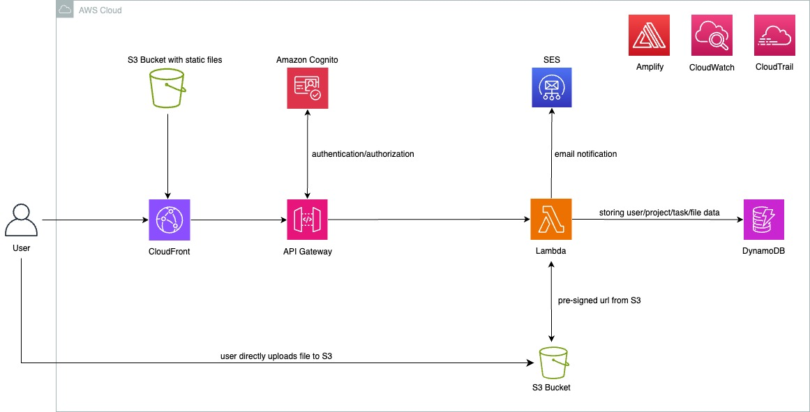

# Task Management Application


## Summary

The primary objective is to develop a Task Management Application that facilitates functionalities such as creating, updating and deleting Projects as well as Tasks within a Project. Additional features include File Attachments, addition and removal of Team Members in a Project and sending Real-Time notifications for Task assignments and completions. This solution is developed by utilizing AWS services such as Amazon Cognito, Amazon API Gateway, AWS Lambda (Python), Amazon DynamoDB, Amazon S3, Amazon SES, Amazon CloudFront and AWS Amplify.

## Pre-requisites

- [ ] An Active AWS account.
- [ ] AWS CLI: Install AWS CLI.
- [ ] Isengard CLI: Setup Isengard CLI. Assume Role using Isengard CLI.
- [ ] AWS Identity and Access Management Roles and permissions with access to AWS Lambda, Amazon S3, Amazon DynamoDB, Amazon SES, AWS CodePipeline.

## AWS Services Used

- [ ] **Amazon Cognito** - Amazon Cognito is an identity management service that provides user directories, authentication, authorization, and integration with social identity providers for web and mobile applications.
- [ ] **Amazon API Gateway** - Amazon API Gateway is a fully managed service that allows developers to create, publish, maintain, monitor, and secure APIs for serverless applications, enabling seamless integration with AWS services and other web services at any scale.
- [ ] **AWS Lambda** - AWS Lambda is a serverless computing service that allows you to run code without provisioning or managing servers, automatically scaling and billing based on compute time consumed.
- [ ] **Amazon DynamoDB** - Amazon DynamoDB is a serverless, fully managed NoSQL database service that provides consistent single-digit millisecond performance at any scale, enabling developers to build modern, highly scalable applications without worrying about provisioning or managing infrastructure.
- [ ] **Amazon S3** - Amazon Simple Storage Service (Amazon S3) is a highly scalable, durable, and secure object storage service that enables customers to store and retrieve any amount of data from anywhere on the internet for a wide range of use cases.. 
- [ ] **Amazon SES** - Amazon Simple Email Service (SES) is a cost-effective, flexible, and scalable email service that allows businesses to send and receive emails using their own domains and email addresses, enabling various use cases such as marketing campaigns, transactional emails, and application-generated correspondence.
- [ ] **Amazon CloudFront** - Amazon CloudFront is a global content delivery network (CDN) service that caches and distributes static and dynamic web content from edge locations worldwide, providing low latency and high performance for delivering data to end users.
- [ ] **AWS Amplify** - A set of tools and services that enables developers to build secure, scalable, and cost-effective mobile and web applications quickly. 
- [ ] **AWS CodePipeline** - AWS CodePipeline is a fully managed continuous delivery service that allows you to model, visualize, and automate the software release process, enabling rapid and reliable application updates through automated build, test, and deploy stages. 

## Architecture Diagram





**User Interface** - Frontend screens are attached in the Images folder for reference.

## Methodology

- [ ] **Implementing User Authentication using Amazon Cognito:** Formation of Cognito User Pool and App Client to authenticate Users accessing the Application.
- [ ] **Formation of Frontend User Interface:** UI is developed using React in order to give User the functionality of accessing Backend services with ease.
- [ ] **Integrating Application with Amplify:** Integrating User Authentication with Frontend Application, handling tasks such as sign-in, sign-up and password management, while seamlessly integrating with AWS services like Amazon Cognito for secure and scalable User Management.
- [ ] **Lambda functions:** Lambda functions in Python are developed to handle the API requests and interact with different services.
- [ ] **Setting up API Gateway:** Created an API Gateway with REST API integration to handle the incoming requests from authenticated application users. 
- [ ] **Integrating API Gateway with Lambda:** Integrated API Gateway with Lambda functions to trigger the functions based on the incoming API requests. 
- [ ] **Setting up an Amazon DynamoDB Database:** Formation of NoSQL database for storing Users, Projects, Tasks, Teams and Files Metadata.
- [ ] **Sending Real-Time Updates and Notifications:** Sending Email Notifications to Users by integrating AWS Lambda and Amazon SES.
- [ ] **Creation of S3 Buckets:** S3 Buckets were used to serve Static Content, upload and download Files using S3 pre-signed URL's.
- [ ] **Content Delivery:** CloudFront is used to serve the Static Files globally by caching the files at Edge Locations.
- [ ] **Continuous Testing and Deployment:** CI/CD Pipelines are created using AWS CodePipeline for continuous Infrastructure Deployment and Testing. 

***

# Local Installation for AWS CLI

**AWS CLI Installation**
```
$ sudo installer -pkg ./AWSCLIV2.pkg -target /
```
**AWS Configure**
```
$ aws configure
```

# Local Installation for Isengard CLI

**Isengard CLI Installation**
```
brew analytics off
brew tap amazon/amazon ssh://git.amazon.com/pkg/HomebrewAmazon
brew update
brew install isengard-cli
```

# Local Installation for Amplify CLI

**Amplify CLI Installation**
```
npm install -g @aws-amplify/cli
```
**Amplify Configure**
```
amplify configure
```

# Local Installation for npm modules

**npm Installation**
```
npm install
```
**Starting React Application**
```
npm run dev
```

# Local Installation for activating Python

**Python3 Installation**
```
python3 -m pip3 install --upgrade pip setuptools wheel
```
**pip3 Installation**
```
sudo apt install python3-pip
```
**Virtual Environment Setup**
```
pip3 install virtualenv
```

```
 mkdir pythonimport
 cd pythonimport
 python3. -m venv env
```

**Activating Virtual Environment**

```
 source env/bin/activate
```

**Deactivating Virtual Environment**
```
 ~deactivate
```
